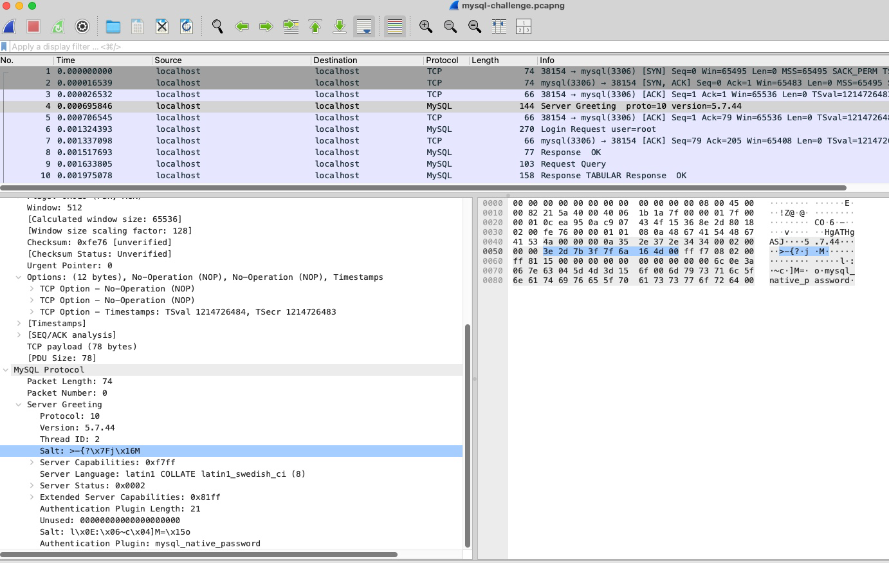
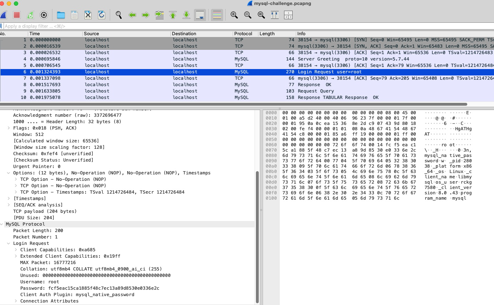

# Requin_filaire : MySQL
**Date:** Septembre 2025
**Challenge Author(s):**  SevenInside
**Difficulty:** Difficile  

## Synopsis
Un malware a enregistré une communication sur la loopback d'un serveur MySQL. Il semblerait que la base de données soit en cours d'initialisation. Trouvez le mot de passe root de la base !

Le flag de validation est de la forme `hit{<mot de passe root>}`

## Fonctionnement de l'authent' MySQL Native Password"
L'authentification mysql_native_password utilise un mécanisme de challenge-response:
* Le serveur envoie un challenge aléatoire (scramble) au client de 20 octets
* Le client calcule une réponse basée sur:
  * Le challenge reçu
  * Le hash du mot de passe de l'utilisateur

```bash
SHA1(password) = hash_stage1
SHA1(SHA1(password)) = hash_stage2
SHA1(scramble + hash_stage2) = hash_stage3
hash_stage3 XOR hash_stage1 = réponse envoyée au serveur
```

ou encore:

```bash
token = SHA1(scramble + SHA1(SHA1(password))) XOR SHA1(password)
```

* Le serveur vérifie cette réponse sans jamais transmettre le mot de passe en clair

Pour retrouver le mot de passe, on doit:
* Extraire le scramble exact des 20 octets depuis la capture
* Extraire la réponse exacte du client
* Effectuer une attaque par force brute en simulant l'algorithme d'authentification

## Extraction du "scramble"

On extrait le "scramble" (challenge) à partir de la requête du serveur (server greeting, trame 4), qui est la concaténation
en hexa des 2 salts:
Dans la trame 4, on voit le scramble MySQL divisé en deux parties:


1ère partie (salt1): >-{?\x7fj\x16M
En hexadécimal: 3e 2d 7b 3f 7f 6a 16 4d
2nde partie (salt2): l\x0e:\x06~c\x04]M=\x15o
En hexadécimal: 6c 0e 3a 06 7e 63 04 5d 4d 3d 15 6f
NB: la concaténation directe ne donne pas exactement 20 octets. Cependant, il faut comprendre que:

* Les caractères comme \x7f représentent un seul octet en notation hexa
* Les caractères ASCII imprimables comme > sont représentés directement

Le scramble complet en hexadécimal est:

```bash
3e2d7b3f7f6a164d6c0e3a067e63045d4d3d156f
```

## Extraction de la réponse du client
On trouve ce hash dans la réponse (trame6):


```bash
fcf5eac15ca1885f48c7ec13a89d8530e0336e2c
```

## Programme:

script_mysql.py:

```python
import hashlib
# Données extraites de la capture
scramble_hex = "3e2d7b3f7f6a164d6c0e3a067e63045d4d3d156f"
response_hex = "fcf5eac15ca1885f48c7ec13a89d8530e0336e2c"
# Conversion en bytes
scramble = bytes.fromhex(scramble_hex)
response = bytes.fromhex(response_hex)
def mysql_native_password(password, scramble):
    """Implémentation de l'algorithme d'authentification mysql_native_password"""
    # Étape 1: SHA1(password)
    hash_stage1 = hashlib.sha1(password.encode()).digest()
    # Étape 2: SHA1(SHA1(password))
    hash_stage2 = hashlib.sha1(hash_stage1).digest()
    # Étape 3: SHA1(scramble + SHA1(SHA1(password)))
    hash_stage3 = hashlib.sha1(scramble + hash_stage2).digest()
    # Étape 4: XOR avec SHA1(password)
    calculated_response = bytes(a ^ b for a, b in zip(hash_stage3, hash_stage1))
    return calculated_response
# Test avec rockyou.txt
def find_password():
    with open('rockyou.txt', 'r', errors='ignore') as f:
        for i, line in enumerate(f):
            password = line.strip()
            calculated = mysql_native_password(password, scramble)
            if calculated.hex() == response_hex:
                return password
            if i % 100000 == 0:
                print(f"Testé {i} mots de passe...")
    return None
# Exécution
print("Recherche du mot de passe en cours...")
password = find_password()
if password:
    print(f"Mot de passe trouvé: {password}")
else:
    print("Mot de passe non trouvé dans le dictionnaire.")
```

## Brute-Force

```bash
admin@l CTF2025 % python3 script_mysql.py
Recherche du mot de passe en cours...
Testé 0 mots de passe...
Testé 100000 mots de passe...
Testé 200000 mots de passe...
Testé 300000 mots de passe...
Testé 400000 mots de passe...
Testé 500000 mots de passe...
Testé 600000 mots de passe...
*** etc ***
Testé 13900000 mots de passe...
Testé 14000000 mots de passe...
Testé 14100000 mots de passe...
Testé 14200000 mots de passe...
Testé 14300000 mots de passe...
Mot de passe trouvé: !!!secret!!!
```

## Explication du processus d'authentification MySQL

Ce challenge illustre comment l'authentification MySQL fonctionne et comment on peut retrouver un mot de passe à
partir d'une capture réseau.
Le mot de passe root trouvé peut être utilisé pour accéder à la base de données 'secure_website' qui contient
probablement d'autres informations sensibles.
1. Le serveur envoie un challenge (scramble) de 20 octets au client
2. Le client calcule:
    * SHA1(password)
    * SHA1(SHA1(password))
    * SHA1(scramble + SHA1(SHA1(password)))
    * XOR entre le résultat précédent et SHA1(password)
3. Le client envoie cette réponse au serveur
4. Le serveur peut vérifier l'authenticité sans connaître le mot de passe en clair

Flag final : `hit{!!!secret!!!}`