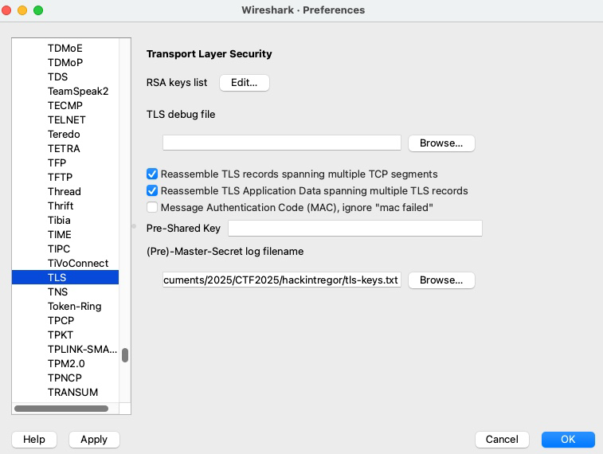
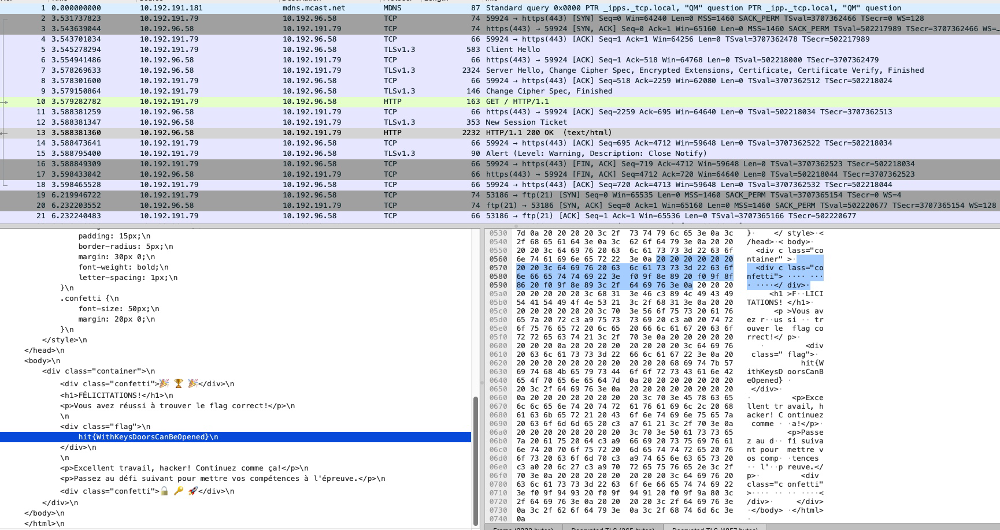

# Requin_filaire : TLS
**Date:** April 2025
**Challenge Author(s):**   SevenInside
**Difficulty:** Facile

## Synopsis 
Un message caché se trouve dans ces trames réseaux

## Secrets TLS via FTP

Un 1er filtre sur FTP montre une connexion anonyme à un serveur FTP et le download de secrets TLS.
Ces chaînes sont des "secrets TLS" utilisés dans TLS 1.3 pour dériver les clés de chiffrement. Ils contiennent:
Les secrets de trafic client et serveur
Les secrets de handshake
L'exporteur de secret
On sauve l'ensemble dans un fichier tls-keys.txt:
```bash
SERVER_HANDSHAKE_TRAFFIC_SECRET b8a3a263d15b4d7a19a939223d360d415914872c809ffd6bbfac65f728eda221
94ad60f544c303b9db710397fc77650f4cd9dd53550e0e82de8aef021baa3984bd64ba79bb0eedf58b7f2ed28f4dbb71
EXPORTER_SECRET b8a3a263d15b4d7a19a939223d360d415914872c809ffd6bbfac65f728eda221
68128fc67ad009098d2e97c199d0279becc5bd30d8e7619f504b3f4d5b90d3211d831450dbf91b5de8ae2d798ace98c5
SERVER_TRAFFIC_SECRET_0 b8a3a263d15b4d7a19a939223d360d415914872c809ffd6bbfac65f728eda221
b628baea014e4a8278ec7ee69d56847f6a589ba5f5289cb4eb8ff7c1881b20fc92942d69d4ad70a45f2883026b28d12c
CLIENT_HANDSHAKE_TRAFFIC_SECRET b8a3a263d15b4d7a19a939223d360d415914872c809ffd6bbfac65f728eda221
a04c70c28db4b8b0a7df5a3c38663cb8819f891a6fd7433ff9fb1794821c955d815266da7e2fb0b510f3f972b43819a7
CLIENT_TRAFFIC_SECRET_0 b8a3a263d15b4d7a19a939223d360d415914872c809ffd6bbfac65f728eda221
5ace351fda987bf1d718c6330d7838579b14ebf1732a26494efe0dfb285276b3a3ece23da7c6931e4cc7aac57a22f6c6
```

## Dechiffrement HTTPs
On peut ensuite utiliser la clé dans Wireshark pour déchiffrer les flux TLS:
Import de la clé dans Wireshark:
Edit > Preferences > Protocols > TLS
Trouver l'option "(Pre)-Master-Secret log filename"
Sélectionner le fichier tls-keys.txt



Les sessions TLS correspondant à ces secrets sont alors automatiquement déchiffrées.
On trouve le flag dans une réponse HTTP 200 OK:


hit{WithKeysDoorsCanBeOpened}