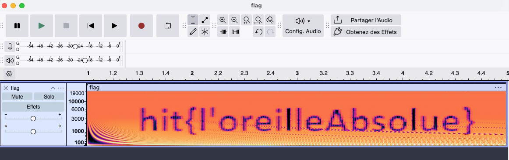

# steganographie : Drôle de bruit
**Challenge Author(s)**: SevenInside
**Difficulty**: Facile

## Synopsis

Un drôle de bruit est mis à disposition. Que peut-il bien cacher

## Résolution

Ouvrir le fichier avec Audacity ou un logiciel permettant de faire de l'analyse spectral de fichiers.
- Click Droit à gauche, sélectionner Spectrogramme.

L'image s'affiche:

Flag : `hit{l'oreilleAbsolue}`
